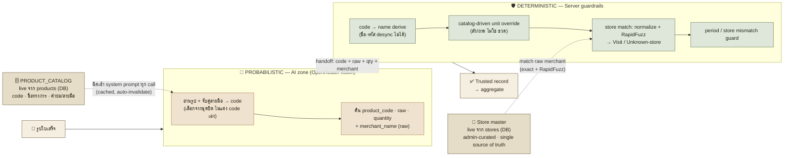
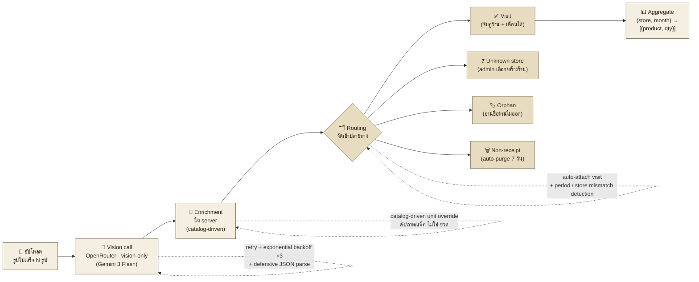
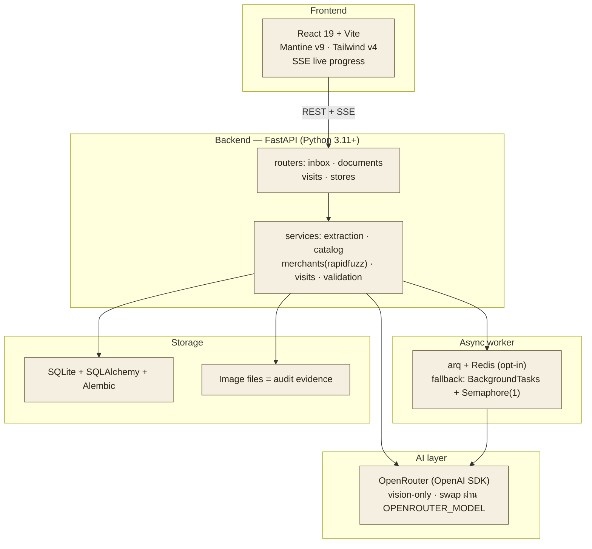

# Technical Flow — สำหรับ present (คะแนน technical)

> ร่างเพื่อเคาะ flow + wording ก่อนทำเป็นสไลด์ HTML (ธีม Ledger)
> แก้คำในนี้ได้เลย แล้วค่อยยกไปทำสไลด์

---

## Diagram 0 — พระเอก: Trust-zone (AI vs Guardrail)

แก่นของเรื่อง: **เราไม่เชื่อ LLM ดื้อๆ** — output ที่เป็น probabilistic ทุกตัว
ถูก re-ground ด้วย logic ฝั่ง server ที่ deterministic ก่อนเข้าสู่ aggregate

**ประโยคปิดบนภาพ:** *"AI เดาเก่ง — แต่เราไม่ปล่อยให้เดาคนเดียว ทุก output ถูกตรวจสอบด้วยกฎที่ deterministic"*

---

## Diagram 1 — ชีวิตของรูปใบเสร็จ 1 ใบ (single-receipt pipeline)

ภาพขยาย: เส้นทางข้อมูลจริง ซ้าย→ขวา + ป้าย callout จุดที่ใส่ "ความฉลาด" เข้าไป

### Callout — wording ที่จะปักบน flow (เคาะคำตรงนี้)

| จุดในflow | callout (สั้น) | ประโยคขยายตอนพูด |
|---|---|---|
| Vision call | **Live catalog injection** | ฉีด PRODUCT_CATALOG จาก DB เข้า system prompt ทุกครั้ง → model อ่าน shorthand ออกเพราะ "รู้จักสินค้า" ไม่ใช่เดา |
| Vision call | **Resilient call** | retry exponential backoff 3 ครั้ง + parse JSON แบบกัน output เพี้ยน (array/nested/หมวดผิด) |
| Enrichment | **Code→name derive** | LLM ส่งแค่ `product_code` + `raw` ชื่อแสดงผลคำนวณฝั่ง server → กัน LLM มั่วชื่อ |
| Enrichment | **Catalog-driven unit** | หน่วยมาจาก catalog (ลัง/ถาด) ไม่ใช่จาก model → aggregate ไม่ปนหน่วย (domain knowledge) |
| Routing | **Self-routing + mismatch guard** | ระบบจัดเข้า visit เอง + ตรวจ period/store ไม่ตรงให้ คนแค่ยืนยัน |

---

## Diagram 2 — Layered architecture (เผื่อกรรมการถาม "สถาปัตยกรรม")

---

## ตัวเลขที่จะโชว์ (technical credibility)

- **1 vision call / ใบเสร็จ** (one-shot — ไม่มี agentic loop)
- **6 ฟิลด์ / ใบเสร็จ**: merchant(raw+normalized), document_number, document_date, category, items[]
- **113 tests** (pytest) + `make typecheck` (tsc strict)
- **4 หมวดสินค้า** (Singha-Online taxonomy)
- retry **×3** · auto-purge non-receipt **7 วัน**

> ⚠️ อย่าโชว์: fraud / price / VAT / discount / totals — ถอดออกหมดแล้ว (pivot พ.ค. 2026) ถ้าโชว์แล้วโดนถามจะตอบไม่ตรง
